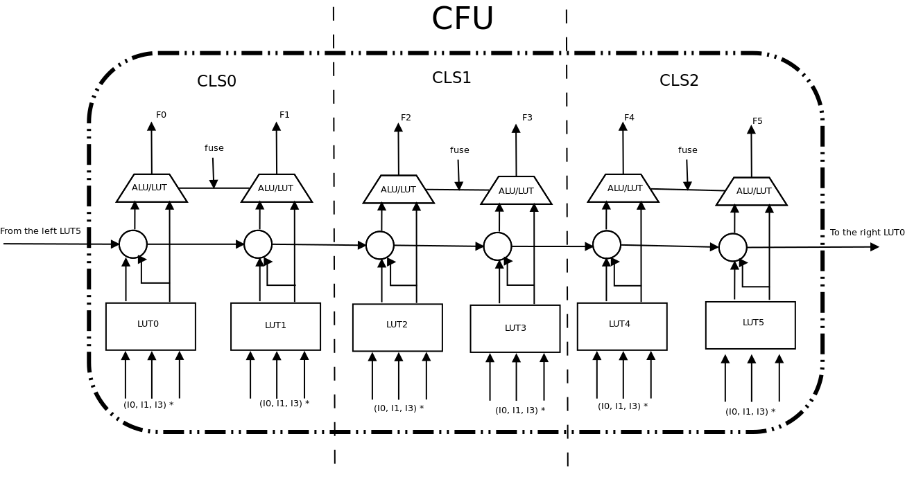

# ALU

In Gowin FPGA logic tiles, it is possible to configure a CLS (slice of two LUTs) in ALU mode. In this mode a hard logic carry chain is used in combination with programmable logic to implement fast arithmatic.

ALU mode is available on the 3 CLS in each tile that have a flip-flop, and configured with a single bit. This selects the `F` LUT output to be passed through the ALU. Hard carry logic runs from east to west from LUT0 to LUT5 across tiles.



The ALU hard logic takes the shape of a full adder, where the carry chain is fully hard logic, and the first `XOR` gate is formed by the `LUT4`. But the lower 4 bits are shared with an additional `LUT2` which mostly acts as an input selector between `A` and `B` in front of the carry `AND`. The `C` input is mostly wired to `1` so the main `LUT4` doesn't use the lower bits, but in one case `C=0` and `D=1` to much the same effect.


On the synthesis side, the ALU primitive supports 9 modes, wich correspond to a bit pattern stored in the LUT, as well as which ports are used, and which are set to constant values.

```
add(0)    0011000011001100  A:-  B:I0 C:1 D:I1 CIN:0
sub(1)    1010000001011010  A:I0 B:-  C:1 D:I1 CIN:1
addsub(2) 0110000010011010  A:I0 B:I1 C:1 D:I2 CIN:??
ne(3)     1001000010011111  A:I0 B:I1 C:1 D:-  CIN:??
ge(4)     1001000010011010  A:I0 B:I1 C:1 D:-  CIN:??
le(5)     1001000010011010  A:I1 B:I0 C:1 D:-  CIN:??
cup(6)    1010000010100000  A:I0 B:I1 C:1 D:-  CIN:??
cdn(7)    0101000001011111  A:I0 B:I1 C:1 D:-  CIN:??
cupcdn(8) 1010000001011010  A:I0 B:I1 C:1 D:I2 CIN:??
mul(9)    0111100010001000  A:I0 B:I1 C:0 D:1  CIN:??
```

These values should be understood as follows: The lowest 4 bits are shared between the `LUT4` in the carry "selector" `LUT2`, so in the case of `ADD` `1100`, selecting `B`. In almost all cases `C:1` which means the output of the `LUT4` is controlled by `AAAA0000AAAA0000` avoiding the lower bits and explainging the zeros in most modes. In the case of `ADD` the `LUT4` function is therefore `00111100`, which is `B XOR D`. In the case of `MUL` `C:0` and `D:1` so indeed only `0000AAAA00000000` is used for the `LUT4`, having the function of `AND`, like the lower `LUT2`. I have confirmed the funcionality is identical with the other clusers set to `0000`. The full list of implemented logic functions:

```
FN         LUT4             LUT2
ADD(0)     B XOR D          B
SUB(1)     !A XOR D         A
ADDSUB(2)  A XOR B XOR !D   A
NE(3)      A XOR B          1
GE/LE(4-5) A XOR B          A
CUP(6)     A                0
CDN(7)     !A               1
CUPCDN(8)  A XNOR D         A
MUL(9)     A AND B          A AND B
```

It seems counterintuitive that the `LUT2` has an asymetric function, but it all works out in the end. See for yourself.

Armed with this knowledge, we can puzzle out what the total function of each `ALU` mode is. Most of them have obvious names with well known truth tables, but `MUL` is a strange one. When we find its total function analytically or experimentally, we find that it computes `A*B+CI`, in other words, an `AND` into a half adder. Our theory is that this could be used in implementing a Wallace tree or other long multiplication algorithm.

As a challenge, I decided to try a full adder that computes `A*B+D+CI`. To implement this the `LUT4` function should be `(A AND B) XOR D` and the `LUT2` function `A AND B`, giving the total data `0111000010001000` which indeed works as expected.